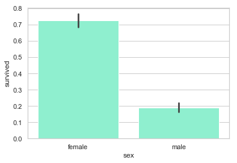

# Titanic_Logistic_Regression
**通过Logistic Regression预测Titanic乘客能否在事故中生还**

1. [导入工具库和数据](#t1.)
2. [缺失数据处理](#t2.)
   - 2.1. [age](#t2.1.)
   - 2.2. [cabin](#t2.2.)
   - 2.3. [embarked](#t2.3.)
   - 2.4. [fare](#t2.4.)
   - 2.5. [其他调整](#t2.5.)
     - 2.5.1 [其它特征的处理](#t2.5.1.)
3. [数据分析](#t3.)
4. [Logistic Regression](#t4.)

<a id="t1."></a>
# 1. 导入工具库和数据
预览数据：
|pclass|	survived|	name|	sex|	age|	sibsp|	parch|	ticket|	fare|	cabin|	embarked
-------------------------------------------------------------------------------------------
0|	1.0|	1.0|	Allen, Miss. Elisabeth Walton|	female	|29.0000|	0.0|	0.0|	24160	|211.3375|	B5	|S
1|	1.0|	1.0|	Allison, Master. Hudson Trevor|	male|	0.9167|	1.0	|2.0	|113781	|151.5500|	C22 C26	|S
2|	1.0|	0.0|	Allison, Miss. Helen Loraine|	female|	2.0000	|1.0	|2.0	|113781	|151.5500	|C22 C26|	S
3|	1.0|	0.0|	Allison, Mr. Hudson Joshua Creighton|	male|	30.0000|	1.0|	2.0|	113781	|151.5500|	C22 C26|	S
4|	1.0|	0.0|	Allison, Mrs. Hudson J C (Bessie Waldo Daniels)|	female|	25.0000	|1.0	|2.0	|113781	|151.5500	|C22 C26	|S

<a id="t2."></a>
# 2. 缺失数据处理
```python
# 查看数据集中各个特征缺失的情况
df.isnull().sum()
```
pclass         1

survived       1

name           1

sex            1

age          264

sibsp          1

parch          1

ticket         1

fare           2

cabin       1015

embarked       3

dtype: int64

<a id="t2.1."></a>
## 2.1.    age
```python
# "age" 缺失的百分比 
print('"age" 缺失的百分比  %.2f%%' %((df['age'].isnull().sum()/df.shape[0])*100))
```
"age" 缺失的百分比  20.15%
年龄的分布情况：

age的偏度不为0, 这里选择使用中间值替代缺失值
<font color=red> 注: 在概率论和统计学中，偏度衡量实数随机变量概率分布的不对称性。偏度的值可以为正，可以为负或者甚至是无法定义。在数量上，偏度为负（负偏态）就意味着在概率密度函数左侧的尾部比右侧的长，绝大多数的值（不一定包括中位数在内）位于平均值的右侧。偏度为正（正偏态）就意味着在概率密度函数右侧的尾部比左侧的长，绝大多数的值（不一定包括中位数）位于平均值的左侧。偏度为零就表示数值相对均匀地分布在平均值的两侧，但不一定意味着其为对称分布。</font>

<a id="t2.2."></a>
## 2.2. cabin
```python
# cabin缺失的百分比
print('"Cabin" 缺失的百分比 %.2f%%' %((df['cabin'].isnull().sum()/df.shape[0])*100))
```
"Cabin" 缺失的百分比 77.48%
约 77% 的乘客的仓位都是缺失的, 所以删除该特征.

<a id="t2.3."></a>
## 2.3. embarked
```python
# embarked的缺失率
print('"Embarked" 缺失的百分比 %.2f%%' %((df['embarked'].isnull().sum()/df.shape[0])*100))
```
"Embarked" 缺失的百分比 0.23%
只有 0.23% 的乘客的登船地点数据缺失, 可以使用众数替代缺失的值。

由于大多数人是在南安普顿(Southhampton)登船, 可以使用“S”替代缺失的数据值

<a id="t2.4."></a>
## 2.4. fare
由于票价跟仓位有对应关系，所以票价的缺失值由同船仓等级的平均票价来填充。

<a id="t2.5."></a>
## 2.5. 其他调整
```python
# 确认数据是否还包含缺失数据
data.isnull().sum()
```
pclass      1

survived    1

name        1

sex         1

age         0

sibsp       1

parch       1

ticket      1

fare        1

embarked    0

dtype: int64

```python
#找出属性name中存在缺失值的行
print(data.name.isnull().value_counts())
data[data.name.isnull()]
```

|pclass	|survived|	name	|sex	|age	|sibsp	|parch	|ticket	|fare	|embarked
-------------------------------------------------------------------------------------------
1309|	NaN|	NaN|	NaN|	NaN	|28.0	|NaN|	NaN|	NaN	|NaN	|S

由于上面的行中多数值都缺失了，所以将这一行删除。

### 查看年龄在调整前后的分布


<a id="t2.5.1."></a>
## 2.5.1. 其它特征的处理

数据中的两个特征 “sibsp” (一同登船的兄弟姐妹或者配偶数量)与“parch”(一同登船的父母或子女数量)都是代表是否有同伴同行. 为了预防这两个特征具有多重共线性, 我们可以将这两个变量转为一个变量 “TravelAlone” (是否独自一人成行)

<font color='red'>注: 多重共线性(multicollinearity)是指多变量线性回归中，变量之间由于存在高度相关关系而使回归估计不准确。比如虚拟变量陷阱（英语：Dummy variable trap）即有可能触发多重共线性问题。</font>

```python
## 创建一个新的变量'TravelAlone'记录是否独自成行, 丢弃“sibsp” (一同登船的兄弟姐妹或者配偶数量)与“parch”(一同登船的父母或子女数量)
data['TravelAlone']=np.where((data["sibsp"]+data["parch"])>0, 0, 1)
data.drop('sibsp', axis=1, inplace=True)
data.drop('parch', axis=1, inplace=True)
```
对类别变量(categorical variables)使用独热编码(One-Hot Encoding), 将字符串类别转换为数值。
```python
# 对 Embarked","Sex"进行独热编码, 丢弃 'name', 'ticket'
final =pd.get_dummies(data, columns=["embarked","sex"])
final.drop('name', axis=1, inplace=True)
final.drop('ticket', axis=1, inplace=True)

final.head()
```
|pclass|	survived|	age|	fare	|TravelAlone|	embarked_C|	embarked_Q	|embarked_S|	sex_female|	sex_male
--------------------------------------------------------------------------------------------
|0	|1.0	|1.0	|29.0000|	211.3375	|1	|0	|0	|1|	1|	0
|1	|1.0	|1.0	|0.9167|	151.5500|	0	|0	|0	|1	0	|1
|2	|1.0	|0.0	|2.0000	|151.5500	|0	|0	|0	|1|	1	|0
|3	|1.0	|0.0	|30.0000	|151.5500|	0	|0|	0	|1	|0	|1
|4|1.0	|0.0	|25.0000	|151.5500|	0	|0	|0	|1	|1|	0

<a id="t3."></a>
# 3. 数据分析

<a id="t3.1."></a>
## 3.1. age

生还与遇难群体的分布相似, 唯一大的区别是生还群体中用一部分低年龄的乘客. 说明当时的人预先保留了孩子的生还机会。

<a id="t3.2."></a>
## 3.2. fare

生还与遇难群体的票价分布差异比较大, 说明这个特征对预测乘客是否生还非常重要. 票价和仓位相关, 也许是仓位影响了逃生的效果, 我们接下来看仓位的分析。

<a id="t3.3."></a>
## 3.3. pclass

很明显, 一等舱的乘客生还几率最高。

<a id="t3.4."></a>
## 3.4. embarked

从法国 Cherbourge 登录的乘客生还率最高。

<a id="t3.5."></a>
## 3.5. TravelAlone

独自成行的乘客生还率比较低. 当时的年代, 大多数独自成行的乘客为男性居多。

<a id="t3.6."></a>
## 3.6. sex

很明显, 女性的生还率比较高。

<a id="t4."></a>
# 4. 使用Logistic Regression做预测
准确率为0.836

